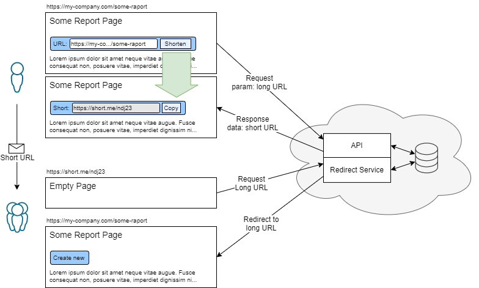

# URL Shortener

Prototype of the URL shortening application. This application includes a front widget and a server side service, responsible for the creation and handling shortened links. The application widget can be embedded on any website.

It is the **MVP version** of the application with includes functionalities necessary for the proof of concept implementation.

## Business assumptions

-   Easy embedding of the widget on any website.
-   The application should work in the public domain and on private networks.

## Benchmark

-   [bit.ly](http://bit.ly)
-   [tiny.pl](http://tiny.pl)

## MVP includes

### Widget

-   On default, shortens the URL of the page where it is embedded.
-   Ability to enter your own url to shorten.
-   Validation of entered URLs.

### Server side service

-   Simple API for adding links and returning shortened urls.
-   Interface for resolving shortened links and redirecting to the correct url.
-   Saving addresses in a file on the server.

## MVP does not include

-   HTTP error handling.
-   Fully styled widget layout.
-   Layout adapted to the client's application.
-   Database for storing urls.

## Features

-   Ability to share a shortened link.
-   Statistics of the links creation and use.
-   Allows only business users (logged in) to create shortened links.
-   Implementation of a database to store shortened links. It is recommended to use a non-relational database (eg MongoDB, ElasticSearch).
-   Multilanguage.
-   Optional - QR Code generator for the created links.
-   Administration panel for managing created links.

## Quickly installation and run

You must have installed Node.js and GIT to install and run this app. Clone the app from GIT repo and follow step by step:

1. Create and edit your local `.env` file. You can use `.env.example` file to copy.
2. `npm run install-all` - Installation of all dependencies - front and server.
3. `npm run dev` - Run the server and front application.

## License

MIT Licensed. Copyright (c) Rafał Bernaczek 2020.
